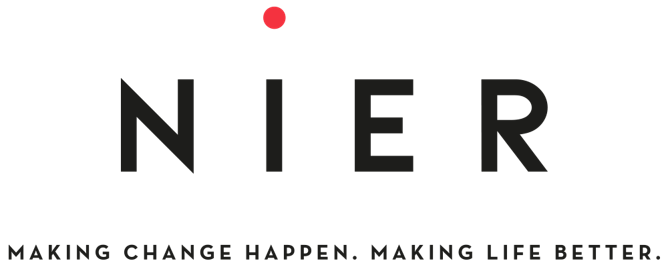
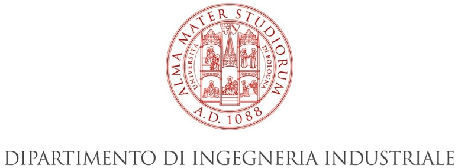
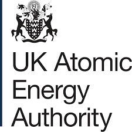

.. _contributor_list:

############
Contributors
############

JADE project was originally started as a joint effort between between `NIER ingegneria <https://www.niering.it/>`_,
`Università di Bologna (UNIBO) <https://ingegneriaindustriale.unibo.it/it>`_
and `Fusion For Energy (F4E) <https://fusionforenergy.europa.eu/>`_.

Nowadays new development is mostly carried on by F4E and the United Kingdom Atomic Energy Authority (UKAEA), more
specifically by the `Culham Centre for Fusion Energy (CCFE) <https://ccfe.ukaea.uk/>`_.

F4E is currently acting as the project coordinator.

This activity was partially funded by Fusion For Energy under F4E-OPE-1128 contract.

.. image:: img/contrib/f4e.jpg
    :width: 300

**JADE contributors:**

.. list-table::
    :widths: 50 50 50 50 50
    :header-rows: 1

    * - Surname
      - Name
      - Contribution
      - Institution/Company
      - Contacts
    * - Bittesnich
      - Alberto
      - Committer
      - F4E
      - alberto.bittesnich@ext.f4e.europa.eu
    * - Bradnam
      - Steve
      - Committer
      - UKAEA
      - steve.bradnam@ukaea.uk
    * - Fabbri
      - Marco
      - Project Coordinator
      - F4E
      - marco.fabbri@f4e.europa.eu
    * - Isolan
      - Lorenzo
      - Tester
      - UNIBO
      - lorenzo.isolan2@unibo.it
    * - Kodeli
      - Ivan
      - Expert
      - UKAEA
      - ivan.kodeli@ukaea.uk
    * - Laghi
      - Davide
      - Technical Leader & Approver
      - ATG at F4E (prev. NIER/UNIBO)
      - davide.laghi@ext.f4e.europa.eu
    * - Sumini
      - Marco
      - Expert
      - UNIBO
      - marco.sumini@unibo.it
    * - Valentine
      - Alex 
      - Committer
      - UKAEA
      - alex.valentine@ukaea.uk
    * - Wheeler
      - Dylan 
      - Committer
      - UKAEA
      - dylan.wheeler@ukaea.uk

