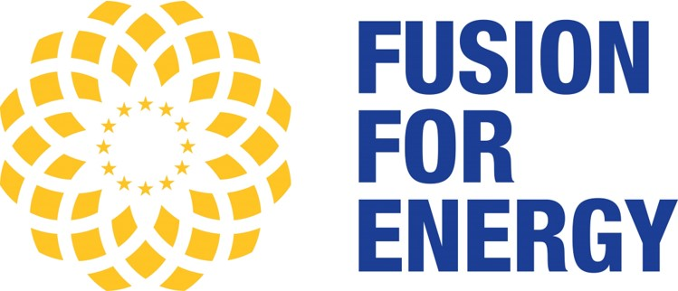

.. _contributor_list:

############
Contributors
############

JADE is the results of a joint effort between `NIER ingegneria <https://www.niering.it/>`_,
`Università di Bologna (UNIBO) <https://ingegneriaindustriale.unibo.it/it>`_
and `Fusion For Energy (F4E) <https://fusionforenergy.europa.eu/>`_.

.. image:: img/contrib/nier.png
    :width: 400
.. image:: img/contrib/unibo.jpg
    :width: 400

**Key People:**

.. list-table::
    :widths: 50 50 50 50
    :header-rows: 1

    * - Name
      - Contribution
      - Institution/Company
      - Contacts
    * - Davide Laghi
      - Founding developer
      - ATG at F4E (prev. NIER/UNIBO)
      - davide.laghi@ext.f4e.europa.eu
    * - Marco Fabbri
      - Project manager and expert
      - F4E
      - marco.fabbri@f4e.europa.eu
    * - Lorenzo Isolan
      - Tester
      - UNIBO
      - lorenzo.isolan2@unibo.it
    * - Marco Sumini
      - Expert
      - UNIBO
      - marco.sumini@unibo.it
    * - Alberto Bittesnich
      - Developer
      - F4E
      - alberto.bittesnich@ext.f4e.europa.eu
    * - Alex Valentine
      - Developer
      - UKAEA
      - alex.valentine@ukaea.uk
    * - Steve Bradnam
      - Developer
      - UKAEA
      - steve.bradnam@ukaea.uk
    * - Dylan Wheeler
      - Developer
      - UKAEA
      - dylan.wheeler@ukaea.uk

