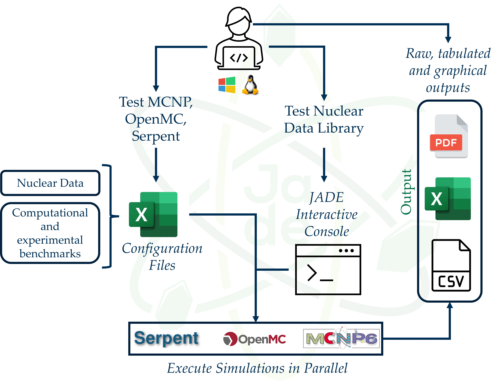

##################
JADE in a nutshell
##################

JADE is a new tool for nuclear libraries V&V.
Brought to you by NIER, University of Bologna (UNIBO), Fusion For Energy (F4E),
and the UK Atomic Energy Authority (UKAEA).
JADE is an open source, Python 3 based software able to:

* Automatically build a series of MCNP input file using different nuclear
  data libraries;
* Run simulations on such inputs;
* Automatically parse and post-process all the generated transport codes outputs.

The benchmarks implemented by default are divided between computational
and experimental benchmarks. The post-processing output includes:

* Raw data in *.csv* files containing the entire tallied output from the
  simulations;
* Formatted Excel recap files;
* Word and PDF atlas files collecting the plots generated during the post-processing.

Additional JADE features are:

* Run JADE with the transport codes OpenMC and Serpent.
* The possibility to implement user-defined benchmarks;
* Operate on the material definitions (e.g. create material mixtures, 
  translate it to a different nuclear data library or switch between atom and
  mass fraction);
* Print a recap of the material composition of an MCNP input;
* Modify the suffix of .ace library;
* Produce default reaction file for D1S-UNED MCNP patch inputs.

When using JADE for scientific publications you are kindly encouraged to cite the following papers:

* D. Laghi et al, 2020, "JADE, a new software tool for nuclear fusion data libraries verification & validation",
  *Fusion Engineering and Design*, **161** 112075, doi: https://doi.org/10.1016/j.fusengdes.2020.112075.
* D.Laghi, M. Fabbri, S. La Rovere, L. Isolan, R. Pampin, A. Portone and M. Sumini,
  2022, "Status of JADE, an open-source software for nuclear data libraries V&V",
  *Fusion Engineering and Design*, **187** 113380, doi: https://doi.org/10.1016/j.fusengdes.2022.113380

For additional information contact: davide.laghi01@gmail.com

For additional information on future developments please check the issues list on the
`JADE GitHub repository <https://github.com/dodu94/JADE/>`_.

.. seealso:: 
  * **MCNP**, Werner C.J., 2017, "MCNP User’S Manual Code", Los Alamos: LAUR-17-29981 (version 6.2).
  * **D1S-UNED**, P. Sauvan et al, 2020, "D1SUNED system for the determination of decay photon related quantities",
    *Fusion Eng. Des.*, **151** 111399.