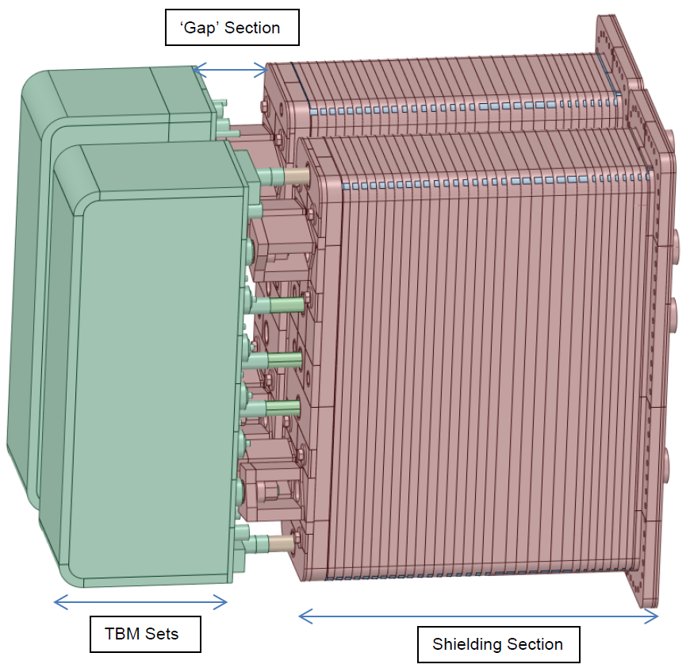
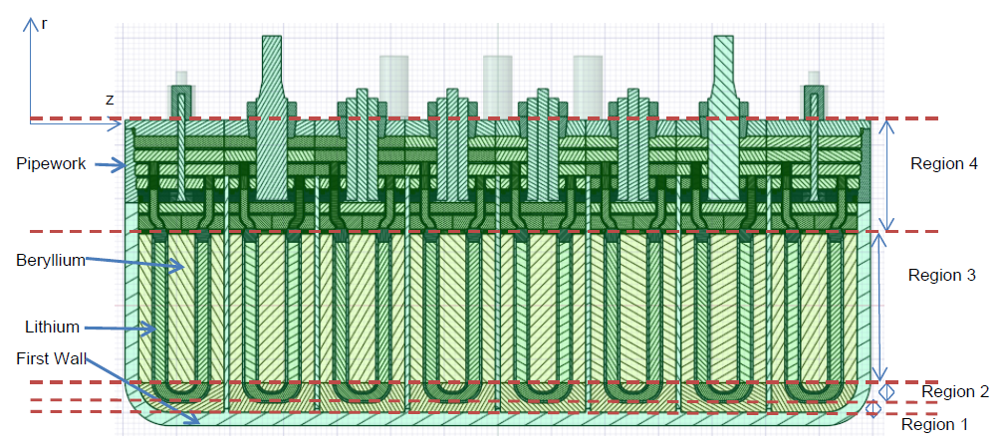
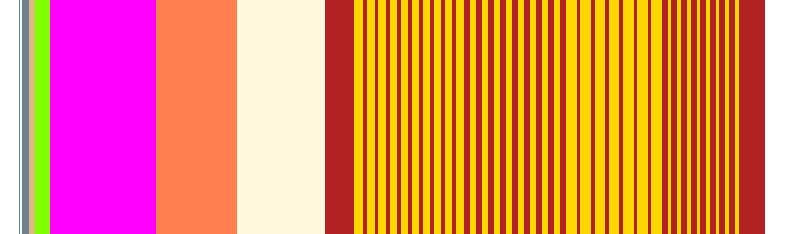
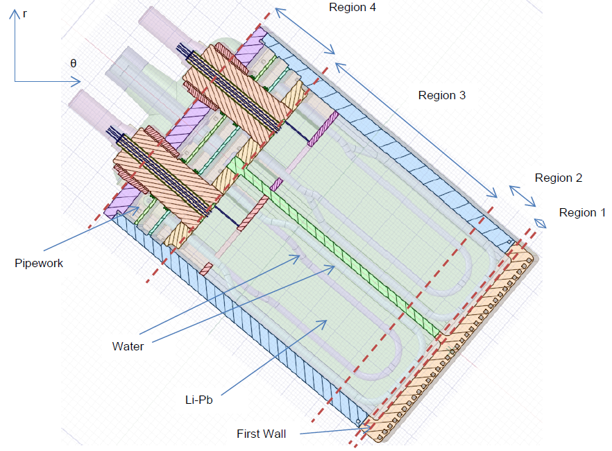

##################
Default Benchmarks
##################
This section describe more in detail all the default benchmarks
that have been implemented in JADE dividing them between
computational and experimental benchmarks.

.. important::
    * Not all benchmark inputs and related files can be distributed
      toghether with JADE due to licensing reasons. In case the user
      provide evidence of licensing rights on specific benchmarks, the
      JADE team will provide the missing input which, once copied 
      in suitable JADE folders, allow to correctly run them.
    * For some of the benchmarks, weight windows (WW) have been produced and
      necessary for the benchmark run. Unfortunately, these WW are often too
      heavy for them to be distributed with Git. These files must be downloaded
      separately and inserted in a suitable folder in ``<JADE_root>\Benchmark inputs\VRT``.  
    * The benchmarks included in JADE can be also divided between
      **transport** benchmarks (ususally associated with classical
      MCNP) and **activation** benchmarks (usually associated with
      D1S-UNED). It is recommended to run these two benchmarks
      categories separately, mostly because they require a different
      input in terms of library to be assessed. If transport Benchmarks
      expect a single library (e.g. ``31c``), activation one require
      two: an activation library and a transport one for all zaids that
      cannot be activated (e.g. ``99c-31c``).
    * In activation benchmarks, the library that is considered the assessed one
      is always the activation library (i.e. the first provided). No track
      is kept during the post-processing of which was the transport library used
      and it is responsability of the user to make sure that comparisons between
      activation libraries results are done in a coherent way. That is, the
      same transport library should be always used.

Computational Benchmarks
========================

Sphere Leakage
--------------
.. figure:: ../img/benchmarks/sphere.png
    :align: center
    
    Sphere Leakage geometrical model

The Sphere Leakage benchmark is arguably the most important 
benchmark included in the JADE suite. Indeed, it allows to test
individually each single isotope of the nuclear data library under assessment
plus some typically used material in the ITER project namely:

* Water;
* Ordinary Concrete;
* Boron Carbide;
* SS316L(N)-IG;
* Natural Silicon;
* Polyethylene (non-borated).

The Sphere Lekage geometry consists of actually three
concentric spheres. The inner one is void and has a radius of 5 cm. Here
is located the uniform probability 0-14 MeV neutron point source. The second sphere
has a radius of 50 cm and it is composed entirely by a single isotope
or a typical ITER material. Finally,
the last 60 cm radius sphere acts as a graveyard where particles importance is
set to zero and the boundary of the model is defined.

**TBD: Describe tallies**

.. seealso:: **Related papers and contributions:**

    * D. Laghi, M. Fabbri, L. Isolan, R. Pampin, M. Sumini, A. Portone and
      A. Trkov, 2020,
      "JADE, a new software tool for nuclear fusion data libraries verification &
      validation", *Fusion Engineering and Design*, **161** 112075

ITER 1D
-------

    ITER 1D MCNP geometry (quarter)

.. seealso:: **Related papers and contributions:**

    * M. Sawan, 1994,  "FENDL Neutronics Benchmark: Specifications for the calculational and shielding benchmark",
      (Vienna: INDC(NDS)-316)

Test Blanket Module
-------------------

.. figure:: ../img/benchmarks/ITERCAD.png
    :width: 600
    :align: center

    Position of the MCNP model in the ITER tokamak

    CAD model of the TBM component

HCPB TBM in ITER 1D
^^^^^^^^^^^^^^^^^^^

    Section of the CAD model of the HCPB TBM set

    Visualization of the TBM and and shielding section in the 1D MCNP geometry

WCLL TBM in ITER 1D
^^^^^^^^^^^^^^^^^^^

    Section of the CAD model of the WCLL TBM set

    Visualization of the TBM and shielding section in the 1D MCNP geometry

C-Model
^^^^^^^
This benchmark input cannot be distributed directly with JADE. The user must request to obtain it
from ITER organization and insert it in the ``<JADE root>\Benchmarks inputs`` directory renaming it
'C_Model.i'.

.. important::
    The NPS card needs to be removed from the input. It is recommended to also delete total bins
    from standard tallies for a clearer post-processing results.

    C-model R181031. Origin (1050,200,0). Basis (0.982339, 0.187112, 0.000000)
    (0,0,1). Extent (1000,1000)

.. seealso:: **Related papers and contributions:**

    * D. Leichtle, B. Colling, M. Fabbri, R. Juarez, M. Loughlin,
      R. Pampin, E. Polunovskiy, A. Serikov, A. Turner and L. Bertalot, 2018,
      "The ITER tokamak neutronics reference model C-Model",
      *Fusion Engineering and Design*, **136** 742-746

Experimental Benchmarks
=======================

Oktavian
--------

.. figure:: ../img/benchmarks/oktavian simplified.png
    :width: 600
    :align: center

    Simplified layout of the OKTAVIAN Fe experimental setup (not on scale).

Experimental results derived from Oktavian experiments are publicly accessible at the
`CoNDERC database <https://www-nds.iaea.org/conderc/oktavian>`_ which is mantained by the
IAEA Nuclear Data Section and built upon the
`database of shielding experiments <https://rsicc.ornl.gov/Benchmarks.aspx>`_ (SINBAD), hosted
by the RSICC and jointly mantained with the NEA data bank.

.. seealso:: **Related papers and contributions:**

    * A. Milocco, A. Trkov and I. A. Kodeli, 2010, "The OKTAVIAN TOF experiments in SINBAD: Evaluation of the
      experimental uncertainties", *Annals of Nuclear Energy*, **37** 443-449
    * I.Kodeli, E. Sartori and B. Kirk, “SINBAD - Shielding Benchmark Experiments - Status and Planned Activities”,
      *Proceedings of the ANS 14th Biennial Topical Meeting of Radiation Protection and Shielding Division*,
      Carlsbad, New Mexico (April 3-6, 2006)
