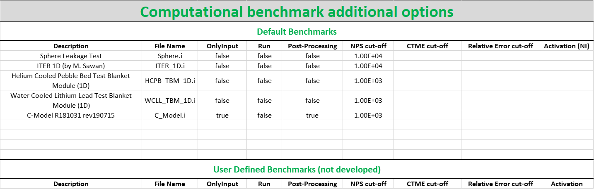
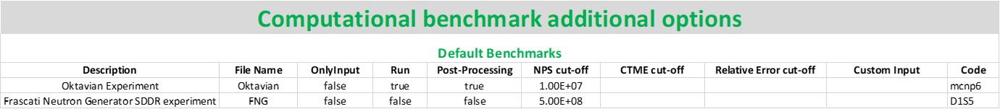
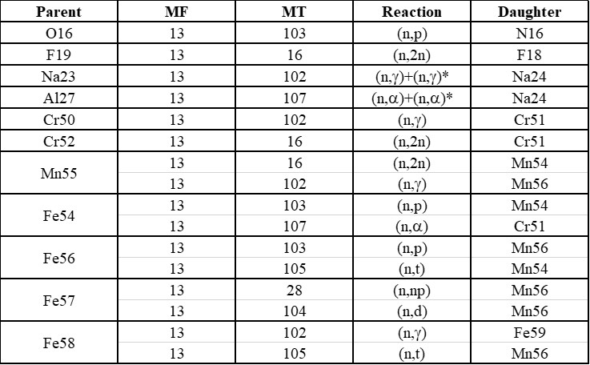

.. _config:

#############
Configuration
#############

All configuration files are included in the ``<JADE_root>\Configuration`` directory.
In principle, **the general user should only operate on the** :ref:`mainconfig` **file**, while
all other configuration files simply guarantee an additional level of personalization for the user.

.. note::
    In case of user-defined benchmarks suitable :ref:`runconf` and :ref:`ppconf` files need
    to be produced.
.. note::
    Every time a new D1S library is added to the user xsdir, in order to use it in JADE a specific
    sheet must be added in the :ref:`activationfile`.

.. _mainconfig:

Main Configuration
==================
The most important configuration file is ``<JADE_root>\Configuration\Config.xlsx``.
This is **the only configuration file that the user must modify** before operating with JADE.
Herafter, a description of the different sheets included in the file is given.

MAIN Config.
------------

This sheet contains the JADE *ambient variables*:

MCNP executable 
   Path to the MCNP executable.

MCNP config
   Name of the config shell script containing environment variables required for running MCNP on UNIX. 
   By default this file should exist already in the same folder as the Config.xlsx named mcnp_config.sh.
   The main purpose of this file is to allow for switching modules and environment variables at runtime
   when performing multi-code runs, as it may be the case a different compiler is required for a specific
   code. If running either single or multiple codes with a correctly configured enviroment, or if running
   on windows, this file can be left empty.

Serpent executable
   Path to Serpent executable.

Serpent config
   Name of the config shell script containing environment variables required for running Serpent on UNIX.
   see MCNP_config above for more information.

OpenMC executable
   Path to OpenmC executable.

OpenMC config
   Name of the config shell script containing environment variables required for running OpenMC on UNIX.
   see MCNP_config above for more information.

D1S executable
   Path to D1S executable (not yet implemented).

D1S config
   Name of the config shell script containing environment variables required for running D1S on UNIX.
   see MCNP_config above for more information (not yet implemented).

OpenMP threads
    Specifies the number of threads to use when running OpenMP executables

MPI tasks
    Specifies how many cores to use when executing an MPI tasks

Batch system
    The command used to run a batch job on the current system, for example LLsubmit for LoadLeveler or sbatch
    for SLURM. This command is required to run any calculation as a job, the code will default to a command
    line run if left blank.

Batch file
    Template of the job submission script to be utilised on the users chosen system. This should match the 
    command provided for the Batch system variable. Several default job submission scripts are provided in
    the Job_Script_Template folder in the Configuration folder. Examples of the layout of these templates
    are detailed below.

.. _compsheet:

Computational benchmarks
------------------------

This table collects allows to personalize which *computational benchmarks* should be included
in the JADE assessment. Each row controls a different benchmark, where the following options
(columns) are available:

Description
    This is the extended name of the benchmark, this name will appear in specific outputs of the
    post-processing.

Folder Name
    Name of the folder containing input files for all codes. These need to be placed in ``<JADE root>\Benchmarks inputs``.

OnlyInput
    When this field is set to ``True`` the benchmark input is only generated but not run. This can be
    useful when the user wants to run the benchmark on a different hardware with respect to the
    one where JADE is being used.

    .. seealso::
        :ref:`externalrun`
    
    .. note::
        This input has priority with respect to the 'Run' one, i.e., if both are
        set to True, the inputs will be only generated and not run.

MCNP
    Runs the benchmark input for MCNP if set to ``True``.
    This allows to customize the selection of benchmarks to be run during an assessment or avoid
    to re-run benchmarks that were already simulated in the past.

Serpent
    As above, runs the benchmark input for Serpent if set to ``True``.

OpenMC
    As above, runs the benchmark input for OpenMC if set to ``True``.

D1S
    As above, runs the benchmark input for D1S if set to ``True`` (NOT YET IMPLEMENTED).

Post-Processing
    this field works exactly as the ``Run`` one but for the post-processing operations. 
    Post processing is performed for any code marked as ``True`` in the corresponding
    row.

NPS cut-off
    this is equivalent to the ``NPS`` entry in the MCNP STOP card. It sets a maximum amount
    of histories to be simulated. Only integers are allowed.

Custom input
    .. versionadded:: v1.3.0
        This columns allows to provide custom inputs to the different benchmarks. For the
        moment, this is used only in the *Sphere Leakage* and *Sphere SDDR* benchmarks where,
        if a number *n* is specified, this will limit the test to the first *n* isotope and 
        material simulations (useful for testing).

Experimental benchmarks
-----------------------

The structure of the sheet is exactly the same as the :ref:`compsheet` one. Nevertheless,
in this table are indicated the settings for the experimental benchmarks.

Libraries
---------

This sheet contains the paths of nuclear data library index files for the various codes.
It is the users responsibility to ensure these are configured correctly, and that in 
the case of comparisons between codes that the xsdir files are equivalent. For a more 
detailed description of these files, refer to the appropriate documentation for each
code

.. warning::
    Do not use invalid filename characters (e.g. ``"\"``) in the names assigned to the
    libraries!

.. _activationfile:

Activation File
===============

The ``<JADE_root>\Configuration\Activation.xlsx`` file stores all the reactions available in the different versions of the D1S-UNED
activation libraries. For each library a sheet needs to be added having as name the 
suffix used in the xsdir file for the library. Only three columns in the table are mandatory
and these are the **Parent**, **MT** and **Daughter** ones.

.. _ppconf:

Computational benchmark post-processing configuration
=====================================================
It is possible to control (to some extent) the post-processing of each benchmark via its 
specific configuration file. These files are located in the ``<JADE_root>\Configuration\Benchmarks Configuration``
folder and their name must be identical to the one used in the ``File Name`` field in the main configuration file
(using the .xlsx extension instead of the .i). These files are available only for computational benchmarks,
since the high degree of customization needed for an experimental benchmark makes quite difficult to 
standardize them. While computational benchmarks can be added to the JADE suite without the need for additional
coding, this is not true also for experimental one.

The files contain two main sheets, that respectively regulate the Excel and the Word/PDF (i.e., Atlas) post-processing output.

Excel
-----

.. image:: ../img/conf/excelbench.png
    :width: 600

This sheet regulates the Excel output derived from the benchmark. It consists of a table where each row regulates
the output of a single tally present in the MCNP input.

Hereinafter a description of the available fields is reported.

Tally
    tally number according to MCNP input file.
x, y
    select the binnings to be used for the presentation of the excel results of the specific tally. Clearly,
    the binning should have been coherently defined in the MCNP input too. MCNP allows different types of tally binning,
    they can be accessed using the tags reported in the table below.

    .. list-table:: Allowed binnings
        :widths: 50
        :header-rows: 1

        * - Admissible **x** and **y**
        * - Energy
        * - Cells
        * - time
        * - tally
        * - Dir
        * - User
        * - Segments
        * - Multiplier
        * - Cosine
        * - Cor A
        * - Cor B
        * - Cor C

    As a result of the selected **x** and **y** option, the results of the post-processed tally will be display in a
    matrix format. In case only a single binning is defined in the MCNP input, the ``tally`` keyword should be used to
    signal to JADE to just to print the results in a column format.

    .. important::
        The main direction of an Excel file is considered to be the vertical one, which is the preferred scrolling direction.
        For this reason, the **x** direction is associated with the vertical direction in an Excel file and the **y** with
        the horizontal one.
    
    .. warning::
        No more than two binnings should be defined for a single MCNP tally due to the limitation of having to represent
        2-D output. JADE may be able to to handle tallies with more than 2 binnings if some of them are constant
        values.
    
    .. tip::
        If a 1D FMESH is defined in the MCNP input, JADE will automatically transform it to a "binned" tally and handle it
        as any other tally using the ``Cor A``, ``Cor B`` or ``Cor C`` field.

x name, y name
    These will be the names associated to the **x** and **y** axis printed in the excel file.

cut Y
    The idea behind JADE is to produce outputs that are easy to investigate simply by scrolling and concentrate on the
    main results highlighted through colors. Having a high number of bins both in the x and y axis may cause a problem
    in this sense, forcing the user to scroll on both axis. For this reason, a maximum number of columns can be set to
    solve this issue. This will cause the tally results not to be printed as a unique matrix but as sequential blocks
    each with a number of columns equal to **cut Y**.

Atlas
-----

.. image:: ../img/conf/atlasbench.png
    :width: 600

This sheet regulates the Atlas output (Word/PDF) derived from the benchmark. It consists of a table where each row regulates
the output of a single tally present in the MCNP input.
Hereinafter a description of the available fields is reported.

Tally
    tally number according to MCNP input file.
Quantity
    Physical quantity that will be plotted on the y-axis of the plot. For the x-axis the one specified in the Excel sheet
    under **x** will be considered. The quantity selected for plotting will always be the tallied quantity.

    .. important::
        when two binnings are specified in the Excel sheet, a different plot for each of the **y** bins will be produced.
        For example, let's consider a neutron flux tally binned both in energy (selected as **x**) and cells (selected as **y**).
        Then, a plot showing the neutron flux as a function of energy will be produced for each cell. On the contrary, if the cell
        binning is assigned to **x** and the energy one to **y**, a plot showing the neutron flux as a function of the cell would
        be produced for each energy interval.
Unit
    Unit associated to the Quantity.
<Graph type>
    Different columns can be added where it can be specified if a plot in the style indicated by the column name
    should be generated (``true``) or not (``false``). The available plot styles are *Binned graph*, *Ratio Graph*,
    *Experimental points* and *Grouped bars*.

    .. seealso::
        :ref:`plotstyles` for an additional description of the available plot styles.

.. _spectrumconfig:

Experimental benchmark post-processing configuration
====================================================

SpectrumOutput class benchmarks configuration files
---------------------------------------------------
When a binned-values data benchmark is inserted (see :ref:`insbin`), a Configuration file 
has to be defined based on the desired final plot result. The filepath is expected to be:
``<JADE_root>\Configuration\Benchmarks Configuration\<BenchmarkName>.xlsx``. The Excel file
must have the following structure: 

.. figure:: /img/dev_guide/Example_config_oktavian.PNG
    :width: 600
    :align: center
    
    Example of Oktavian configuration file structure

The Atlas will contain one plot for each tally of the MCNP input, for each MCNP input if
multiple runs are foreseen. each column corresponds to some details in the resulting plot,
for instance:

.. figure:: /img/dev_guide/plot_example.PNG
    :width: 600
    :align: center
    
    Example of Oktavian plot with all the corresponding configurations

Again, in case of multiple runs each tally number must represent the same quantity in all MCNP inputs for 
consistency of the parameters in the configuration file. If a tally in the configuration file is not present
in a MCNP input file (e.g. a spectrum is collected in all MCNP inputs except one), it will be skipped.
If a tally is present in a MCNP input but experimental data is not available for that tally, it will be skipped.
Obviously, the quantity and the units in the configuration file and in the experimental data file
must be consistent.

The ``C/E X quantity intervals`` column must be defined as a series of numbers separated
by a ``-``, which will be the upper values of the energy bins used for the interpolation and
the printing of C/E tables:

.. figure:: /img/dev_guide/CE_example.PNG
    :width: 600
    :align: center
    
    Example of C/E tables for SpectrumOutput class

The values in the column ``Y label`` must be different for each tally in the MCNP input
and should identify univocally the plotted quantity

.. _multspectrumconfig:

MultipleSpectrumOutput class benchmarks configuration files
-----------------------------------------------------------
All the considerations made in :ref:`spectrumconfig` still hold, but the Excel file
must have a different structure: 

.. figure:: /img/dev_guide/Example_config_fnstof.PNG
    :width: 600
    :align: center
    
    Example of FNS-TOF configuration file structure

Every tally an its parameters from every MCNP input file must be listed as a row in the 
configuration file. A group number must be assigned to each row. Tallies belonging to the same group
will be plotted together. The user should pay attention on the fact that only plots
with the same quantities in both X and Y axis and with the same units are consistent.
Groups should be numbered starting from 1 to the last group number and their number corresponds
to their position in the ``Atlas``. In the example above, for instance, all tallies in
each MCNP input are plotted together (neutron leakage spectra at different detectors' locations'),
but in principle also tallies from different MCNP inputs can be plotted together.

In the following, an example of a resulting plot and the meaning of the parameters
from the configuration file are shown:

.. figure:: /img/dev_guide/plot_example_tof.PNG
    :width: 600
    :align: center
    
    Example of FNS-TOF plot and parameters

The title of the plot can be personalized in the code, the default is the name of the benchmark +
the name of the quantity.       
The combination of ``Particle``, ``Quantity`` and ``Y label`` must univocally identify the tally
inside the group, i.e. no tally can have the same ``Particle``, ``Quantity`` and ``Y label``
parameters at the same time.
