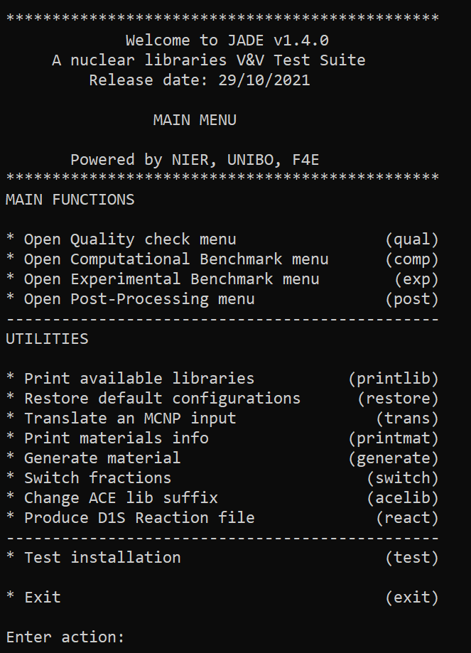
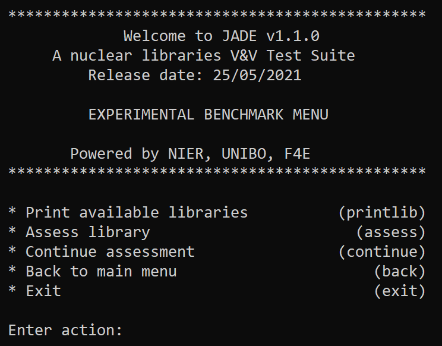
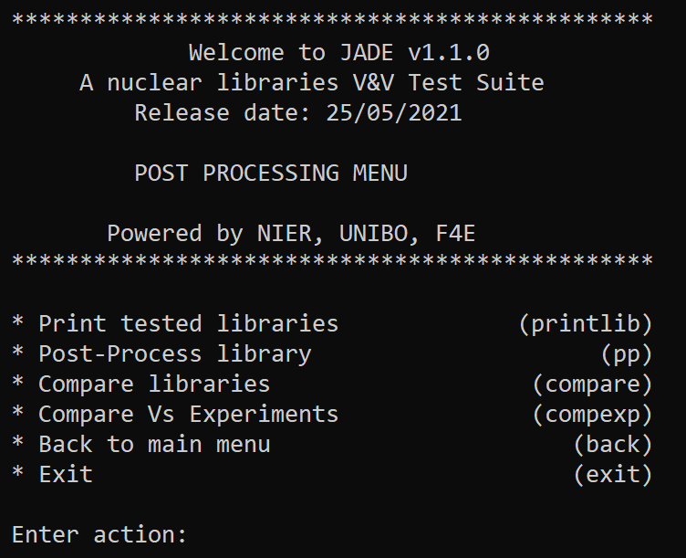

.. _menu:

#######################
Usage
#######################
Once JADE is correctly configured
(for additional details see :ref:`config`), the application can be started
from the 'Code' folder with:

``python main.py``

The main menu is loaded at this point:

This menu allows users to interact with the tool directly from the
command prompt via pre-defined commands.
The following main option are available typing from the main menu:

* ``qual`` not currently supported;
* ``comp`` opens the :ref:`compmenu`;
* ``exp`` opens the :ref:`expmenu`;
* ``post`` opens the :ref:`postmenu`;
* ``exit`` exit the application.

Additionaly to these main options, a series of "utilities" can be also accessed
from the main menu. These are a collection of side-tools initially developed
for JADE that nevertheless can be useful also as stand-alone tools.
A detailed description of these functionalities can be found in :ref:`uty`.

Quality check menu
==================
Not implemented.

.. _compmenu:

Computational Benchmark menu
============================

.. image:: ../img/compmenu.png
    :width: 400

The following options are available in the computational benchmark menu:

* ``printlib`` print to video all the available nuclear data libraries
  in the xsdir file selected during JADE configuration;
* ``assess`` start the assessment of a selected library on the computational benchmarks. The library is
  specified directly from the console when the selection is prompted to
  video. The library must be contained in the xsdir file (available libraries
  can be explored using ``printlib``).
* ``continue`` **currently, this option is implemented only for the Sphere Leakage
  benchmark.** Continue a previously interrupted assessment for a selected
  library. The codes scans for all isotopes and materials in the sphere benchmarks
  and checks if the mctal file has been produced. If not, it deletes the eventual
  output files and (re)runs the simulation.
* ``back`` go back to the main menu;
* ``exit`` exit the application.

The selection of the libraries is done indicating their correspondent suffix specified in the xsdir file
(e.g. ``31c``). Activation benchmarks need to be run separetly since they require two different libraries
to be specified: one for activation and one for transport. Activation library must always be specified
first (e.g. ``99c-31c``).

.. note::
  Whenever an assessment is requested, all the benchmarks selected in the main configuration file will be considered.
  In case the requested library was already assesed on one or more of the active benchmarks,
  the user will be asked for permission before overriding the results.

.. seealso::
  :ref:`config` for additional details on the benchmark selection.

.. _expmenu:

Experimental Benchmark menu
===========================

The following options are available in the experimental benchmark menu:

* ``printlib`` print to video all the available nuclear data libraries
  in the xsdir file selected during JADE configuration;
* ``assess`` start the assessment of a selected library on the experimental benchmarks. The library is
  specified directly from the console when the selection is prompted to
  video. The library must be contained in the xsdir file (available libraries
  can be explored using ``printlib``);
* ``continue`` **[not implemented]**
* ``back`` go back to the main menu;
* ``exit`` exit the application.

The selection of the libraries is done indicating their correspondent suffix specified in the xsdir file
(e.g. ``31c``). Activation benchmarks need to be run separetly since they require two different libraries
to be specified: one for activation and one for transport. Activation library must always be specified
first (e.g. ``99c-31c``).

.. note::
  Whenever an assessment is requested, all the benchmarks selected in the main configuration file will be considered.
  In case the requested library was already assesed on one or more of the active benchmarks,
  the user will be asked for permission before overriding the results.

.. seealso::
  :ref:`config` for additional details on the benchmark selection.

.. _postmenu:

Post-processing menu
====================

The following options are available in the post-processing menu:

* ``printlib`` print all libraries that were tested and that are available for post-processing;
* ``pp`` post-process a single library;
* ``compare`` compare different libraries results on computational benchmarks;
* ``compexp`` compare different libraries results on experimental benchmarks;
* ``back`` go back to the main menu;
* ``exit`` exit the application.

For the ``pp``, ``compare`` and ``compexp`` the selection of the libraries will be directly prompt to video.
The selection of the libraries is done indicating their correspondent suffix specified in the xsdir file
(e.g. ``31c``). When comparing more than one library, the suffixes should be separated by a '-' (e.g. ``31c-32c``).
The first library that is indicated is always considered as the *reference library* for the post-processing.
There may be a limitation on the number of libraries that can be compared at once depending on the post-processing settings.

Only one library at the time can be post-processed with the ``pp`` option. Nevertheless, when a comparison is requested that
includes libraries that were not singularly post-processed, an automatic ``pp`` operation is conducted on them.

.. warning::
  Please note that ``printlib`` will simply show all libraries for which at least one benchmark has been run.

.. warning::
  Please note that part of the single post-processing of the libraries is used in the comparisons. Also, JADE does not perform
  any checks on the consistency between the two. This responsability is left to the user.
  The following is an example of incorrect usage that can lead to erroneous results:
  
  #. a first assessment is run;
  #. single post-processing is completed;
  #. some configuration settings are changed and the assessment is re-run;
  #. a comparison is requested.
  
  In this case, JADE cannot know that the first single post-processing was done on a different benchmark run with respect
  to the requested comparison. As a result, the outputs coming from different assessments will be mixed up. 

.. note::
  Whenever a post-processing is requested, all the benchmarks selected in the main configuration file will be considered.
  In case one or more of the requested libraries were already post-processed on one or more of the active benchmarks,
  the user will be asked for permission before overriding the post-processing results.

.. seealso::
  :ref:`config` for additional details on the benchmark selection.

