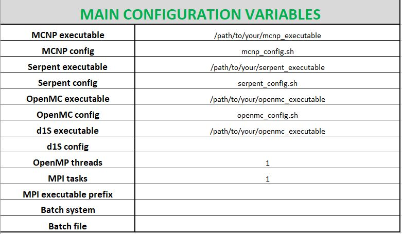
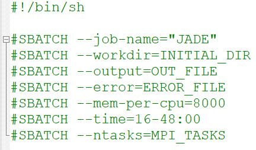

.. _menu:

#######################
Usage
#######################

Main menu
=========
Once JADE is correctly configured
(for additional details see :ref:`config`), JADE can be launched in the root directory
(above the Code folder) by typing in the command line ``jade``.

The main menu is loaded at this point:

.. image:: ../img/main_menu.png
    :width: 400

This menu allows users to interact with the tool directly from the
command prompt via pre-defined commands.
The following main option are available typing from the main menu:

* ``qual`` not currently supported;
* ``comp`` opens the :ref:`compmenu`;
* ``exp`` opens the :ref:`expmenu`;
* ``post`` opens the :ref:`postmenu`;
* ``exit`` exit the application.

Additionaly to these main options, a series of "utilities" can be also accessed
from the main menu. These are a collection of side-tools initially developed
for JADE that nevertheless can be useful also as stand-alone tools.
A detailed description of these functionalities can be found in :ref:`uty`.

If the user is running simulations in JADE, the option to run in the command line
or submit as a job will be presented. The user should have set appropriate values
for the number of OMP threads and MPI tasks, and correclty set up their appropriate 
job submission template (see :ref:`config`). This is further detailed below in :ref:`parallelrunning`.

Quality check menu
==================
Not implemented.

.. _compmenu:

Computational Benchmark menu
============================

.. image:: ../img/compmenu.png
    :width: 400

The following options are available in the computational benchmark menu:

* ``printlib`` print to video all the available nuclear data libraries
  in the xsdir file selected during JADE configuration;
* ``assess`` start the assessment of a selected library on the computational benchmarks. The library is
  specified directly from the console when the selection is prompted to
  video. The library must be contained in the xsdir file (available libraries
  can be explored using ``printlib``).
* ``continue`` **currently, this option is implemented only for the Sphere Leakage
  benchmark.** Continue a previously interrupted assessment for a selected
  library. The codes scans for all isotopes and materials in the sphere benchmarks
  and checks if the mctal file has been produced. If not, it deletes the eventual
  output files and (re)runs the simulation.
* ``back`` go back to the main menu;
* ``exit`` exit the application.

The selection of the libraries is done indicating their correspondent suffix specified in the xsdir file
(e.g. ``31c``). Activation benchmarks need to be run separetly since they require two different libraries
to be specified: one for activation and one for transport. Activation library must always be specified
first (e.g. ``99c-31c``).

.. note::
  Whenever an assessment is requested, all the benchmarks selected in the main configuration file will be considered.
  In case the requested library was already assesed on one or more of the active benchmarks,
  the user will be asked for permission before overriding the results.

.. seealso::
  :ref:`config` for additional details on the benchmark selection.

.. _expmenu:

Experimental Benchmark menu
===========================

.. image:: ../img/expmenu.png
    :width: 400

The following options are available in the experimental benchmark menu:

* ``printlib`` print to video all the available nuclear data libraries
  in the xsdir file selected during JADE configuration;
* ``assess`` start the assessment of a selected library on the experimental benchmarks. The library is
  specified directly from the console when the selection is prompted to
  video. The library must be contained in the xsdir file (available libraries
  can be explored using ``printlib``);
* ``continue`` **[not implemented]**
* ``back`` go back to the main menu;
* ``exit`` exit the application.

The selection of the libraries is done indicating their correspondent suffix specified in the xsdir file
(e.g. ``31c``). Activation benchmarks need to be run separetly since they require two different libraries
to be specified: one for activation and one for transport. Activation library must always be specified
first (e.g. ``99c-31c``).

.. note::
  Whenever an assessment is requested, all the benchmarks selected in the main configuration file will be considered.
  In case the requested library was already assesed on one or more of the active benchmarks,
  the user will be asked for permission before overriding the results.

.. seealso::
  :ref:`config` for additional details on the benchmark selection.

.. _postmenu:

Post-processing menu
====================

.. image:: ../img/postmenu.png
    :width: 400

The following options are available in the post-processing menu:

* ``printlib`` print all libraries that were tested and that are available for post-processing;
* ``pp`` post-process a single library;
* ``compare`` compare different libraries results on computational benchmarks;
* ``compexp`` compare different libraries results on experimental benchmarks;
* ``back`` go back to the main menu;
* ``exit`` exit the application.

For the ``pp``, ``compare`` and ``compexp`` the selection of the libraries will be directly prompt to video.
The selection of the libraries is done indicating their correspondent suffix specified in the xsdir file
(e.g. ``31c``). When comparing more than one library, the suffixes should be separated by a '-' (e.g. ``31c-32c``).
The first library that is indicated is always considered as the *reference library* for the post-processing.
There may be a limitation on the number of libraries that can be compared at once depending on the post-processing settings.

Only one library at the time can be post-processed with the ``pp`` option. Nevertheless, when a comparison is requested that
includes libraries that were not singularly post-processed, an automatic ``pp`` operation is conducted on them.

.. warning::
  Please note that ``printlib`` will simply show all libraries for which at least one benchmark has been run.

.. warning::
  Please note that part of the single post-processing of the libraries is used in the comparisons. Also, JADE does not perform
  any checks on the consistency between the two. This responsability is left to the user.
  The following is an example of incorrect usage that can lead to erroneous results:
  
  #. a first assessment is run;
  #. single post-processing is completed;
  #. some configuration settings are changed and the assessment is re-run;
  #. a comparison is requested.
  
  In this case, JADE cannot know that the first single post-processing was done on a different benchmark run with respect
  to the requested comparison. As a result, the outputs coming from different assessments will be mixed up. 

.. note::
  Whenever a post-processing is requested, all the benchmarks selected in the main configuration file will be considered.
  In case one or more of the requested libraries were already post-processed on one or more of the active benchmarks,
  the user will be asked for permission before overriding the post-processing results.

.. seealso::
  :ref:`config` for additional details on the benchmark selection.

.. _parallelrunning:

Running Simulations in JADE
===========================

Before running simulations in JADE, the users environment should be correctly configured. This is handled by configuration
scripts located in the ``<JADE_root>/Configuration/`` folder. Here, three separate files are present for MCNP, Serpent,
OpenMC and D1S. These scripts are given as examples and should be edited to load required modules and export required environment variables.
The relative path is specified in the main sheet of the Config file (see below).

The user may choose to run simulations in the command line or submit jobs on a cluster. Currently the 
following options are supported for Linux operating systems:

* Running in the command line in serial 
* Running in the command line using OpenMP threading
* Submission as a job in serial
* Submission as a job using MPI
* Submission as a job using OpenMP threading

It is also possible with Serpent and OpenMC to run with MPI+OpenMP hybrid. This is not supported for MCNP. JADE is by
default only run in the command line on Windows. 

The specification of the number of CPU cores is driven by the main sheet of the Config file (below). Here the number of
OpenMP threads and MPI tasks is specified. If running in serial, both of these entries should be set equal to 1. 
A common case for running in the command line is to use threading on your local machine. The number of the OpenMP 
threads should be specified accordingly. This is then used as the entry for *tasks*, *-omp* and *-s* for MCNP, 
Serpent and OpenMC respectively. 

Submitting JADE as a job will depend on the system architecture of the user. At v3.0.0, JADE has been predominantly 
tested with systems using the SLURM workload manager however the code designed to be as flexible as possible to 
accomodate other job schedulers. The job submission script should be prepared and placed in the ``<JADE_root>/Configuration/Job_Script_Templates`` folder. Examples 
are present in the folder for SLURM and LoadLeveler job scripts. In the example for SLURM (below), a set of default SBATCH 
directives are included which can be extended or modified. 

The variables are populated at run time based on the entries in the Config file and the benchmark being run (determines output file name etc.). 
The environment and any dependencies should be correctly configured through the *code_config.sh* script above so do not need to be added to the job script. 
JADE will include the executable in the script. The path to the job script template should be entered in the **Batch file** entry of the Config. 

This jobs script is copied into the folder within ``<JADE_root>/Tests/Simulations``  where the benchmark is being run. JADE will add
the executable and if specified, prepend this with the **MPI executable prefix**. For example, if parallel jobs are launched 
using 'mpirun /path/to/mcnp/executable' then 'mpirun' should be entered in this field. 

Jobs will be submitted using the command specified in the **Batch system** field of Config. For example, if you would normally
submit jobs using 'sbatch my_job_script.sh' then 'sbatch' should be entered in this field.

.. warning::
  JADE does not perform any inherent job monitoring - this is the responsibility of the user. 