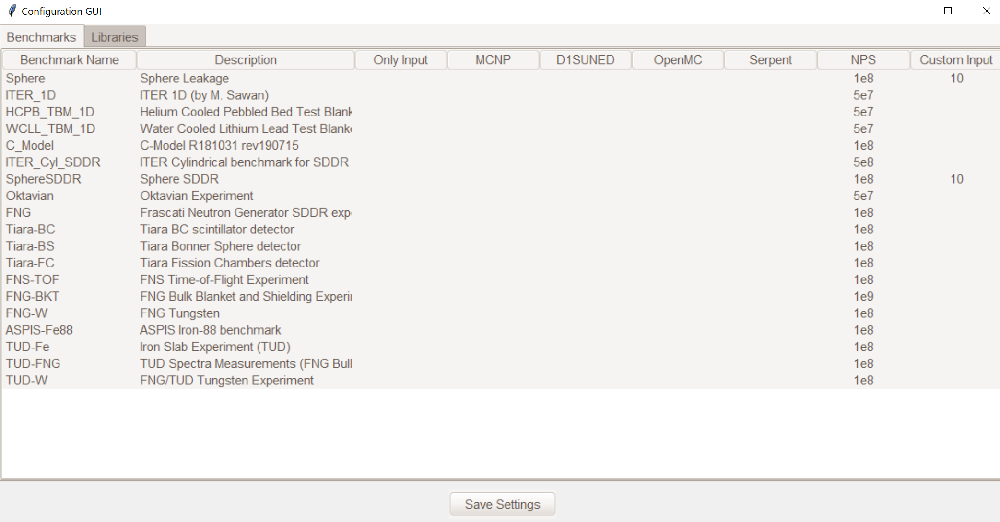

###
Run
###

Before being able to run JADE, the instructions contained in :ref:`install` and
:ref:`config` must be followed.

Configure the run
=================
Once the software is installed and
properly configured the user can select through the GUI which cases to run.

To open the run configuration GUI the user can move to the JADE root directory
and run from the command line:

    | ``jade --rungui``

or 

    | ``python -m jade --rungui``

A window like the one below should open:

    Benchmark selection TAB

In this tab the user can select wich benchmarks to run and with which transport codes.
The following is a brief description of the different columns contents/option:

Benchmark Name
    Name of the benchmark. This is the string used in all folders, config files and input files
    related to that benchmark.folder containing input files for all codes.

Description
    This is the extended name of the benchmark, this name will appear in specific outputs of the
    post-processing.

OnlyInput
    When this field is set to ``True`` the benchmark input is only generated but not run. This can be
    useful when the user wants to run the benchmark on a different hardware with respect to the
    one where JADE is being used. The input will be generated for each selected code.

    .. seealso::
        :ref:`externalrun`

MCNP
    Runs (or only generate) the benchmark input for MCNP.

Serpent
    Runs (or only generate) the benchmark input for Serpent.

OpenMC
    Runs (or only generate) the benchmark input for OpenMC.

D1S
    Runs (or only generate) the benchmark input for D1SUNED.

NPS cut-off
    Number of histories to be simulated. Default values should provide
    sufficient statistical convergence but users are free to increase them.

Custom input
    This columns allows to provide custom inputs to the different benchmarks. For the
    moment, this is used only in the *Sphere Leakage* and *Sphere SDDR* benchmarks where,
    if a number *n* is specified, this will limit the test to the first *n* isotope and 
    material simulations (useful for testing).

Each benchmark that has at least one code (or the Only Input flag) selected will appear in the
"Libraries" tab:

    Libraries selection TAB

Users need to select at least one library to be used for each benchmark or the run will not
be performed for that benchmark.

Once also the libraries are selected the user can save the settings using the "Save Settings"
button.

.. important::
    The user is free to save the file to whatever location in case multiple settings need to
    be prepared. Nevertheless, JADE will always look for the ``<root>/cfg/run_cfg.yml`` file
    when the run is started. This is the file to be overridden and it is also the file that 
    is loaded when the run GUI is opened. That is, settings of the previous run remain saved.

Run the benchmarks
==================
To run the selected benchmarks with the indicated transport code-library couples the user can
simply run in the root directory from the command line:

    | ``jade --run``

or 

    | ``python -m jade --run``
