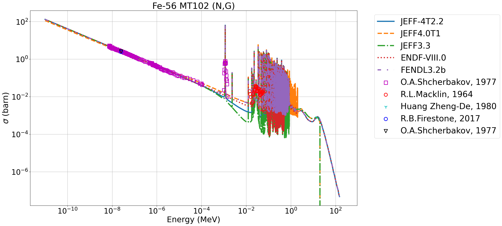

.. _uty:

#########
Utilities
#########
During the development of JADE, many useful classes and methods were developed
which could be used for small stand-alone tools, mostly
operating on MCNP inputs.

A description of these *utilities*, accessible from the JADE main menu,
is here provided.

The outputs (if generated) of these utilities can be found in specific subfolders
of the ``<JADE root>\Utilities`` directory.

Print available libraries
=========================

``printlib``

This function allows to print to video all libraries (suffixes) that are
available in xsdir file indicated in the main configuration file.

.. figure:: ../img/uty/printlib.png
    :width: 600
    :align: center

    Screenshot of the execution of the ``printlib`` command

Restore default configurations
==============================
``restore``

This function allows to restore the JADE configuration default settings.
In other words, the content of the ``<JADE root>\Configuration`` directory
is restored to "factory installation" and all user modifications to the 
configuration files are lost.

.. note::
    When the the restoration is completed, the application will be terminated.
    The main configuration file ambient variable will need to be reconfigured
    before running another JADE instance.

.. seealso::
    :ref:`mainconfig`

Change .ace libraries suffix
============================
.. versionadded:: v1.3.0
    ``acelib``

This function asks for a directory absolute path and for a new library suffix
(e.g. ``98c``). All .ace files contained in the folder will have their original
suffix changed to the new one. This function operates in a non-destructive way,
that is, the switch is not implemented on the original file but on copies of
them instead. The copies will be saved in a folder created at the same level of
the original one. **This function does not modify the XSDIR file.**

Remove runtpe files
===================
.. versionadded:: v2.0.2
    ``rmvruntpe``

This function allows to remove all MCNP runtpe files produced during the
library assessment. These files, once the simulations are terminated correctly,
are kind of useless for the post-processing and they consume a large amount
of storage memory (up to 95% for MCNP produced outputs).

Interactive acefile and EXFOR data plotter
==========================================
``comparelib``

This function is used to generate comparison plots of microscopic neutron 
cross-sections from ACE file data from different data libraries. It also provides
the possibility of including EXFOR experimental data in the comparison plots.
Once the utility is launched, the user will be require to:

* choose the nuclide for which the comparison will be made in ZAID format (e.g. 3006)
* choose neutron reaction cross-sections to be printed. The function checks if
  the MT numeber is correct, if the chosen reactions are not present in some 
  libraries, they will not be printed for those libraries. The user can input multiple 
  MT numbers (hit Enter after each individual entry). Then type continue once the MT(s) 
  are entered;
* choose nuclear data libraries from which the selected nuclear reaction 
  cross-sections will be printed. The chosen libraries must be defined in
  ``<JADE_root>\Configuration\Configuration.xlsx`` file. As above multiple libraries are entered
  until the user enters continue;
* choose if EXFOR experimental data for those specific nuclide and reactions are 
  to e printed. This last feature requires the installation of the optional 
  package 'x4i3' in JADE environment. Further details on installation and usage
  of this package can be found here: https://github.com/afedynitch/x4i3

JADE will provide matplotlib plots of each cross-section as a function of
energy, in a direct comparison of the chosen nuclear data libraries. If 
required, correspondent EXFOR experimental data will be printed. The plotter can
print cross-sections from up to 4 nuclear data libraries at the same time and
up to 15 sets of EXFOR experimental data in the same plot (mainly for 
visualization purposes, experimental data will be chosen starting from the 
largest datasets). In the following, an example of a picture produced by the 
plotter:

Download benchmark inputs from the IAEA GitHub repository
=========================================================
``iaeafetch``

This function is used to fetch JADE inputs and experimental data from the IAEA GitHub. 
The files are hosted at https://github.com/IAEA-NDS/open-benchmarks.
At the moment this repository is private and fetching requires the
provision of a GitHub token from a GitHub account that have access.
More information on GitHub tokens can be found at https://docs.github.com/en/authentication/keeping-your-account-and-data-secure/managing-your-personal-access-tokens

Add RMODE 0 card to MCNP input files
====================================
``rmode``

When running in clusters it may be useful to run the benchmarks with the prompt version of
D1SUNED which is faster with respect to vanilla MCNP. In order to do so, inputs need to
have the RMODE 0 keyword in them. This utility adds the RMODE 0 card to all the mcnp input files.
If there is a need to restore the original inputs, these can be re-fetched from the IAEA GitHub repository.