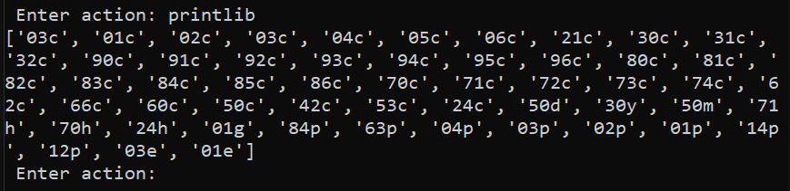
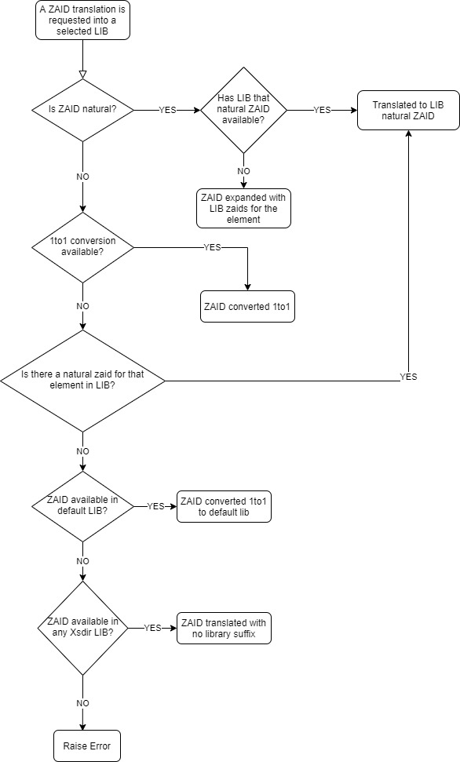
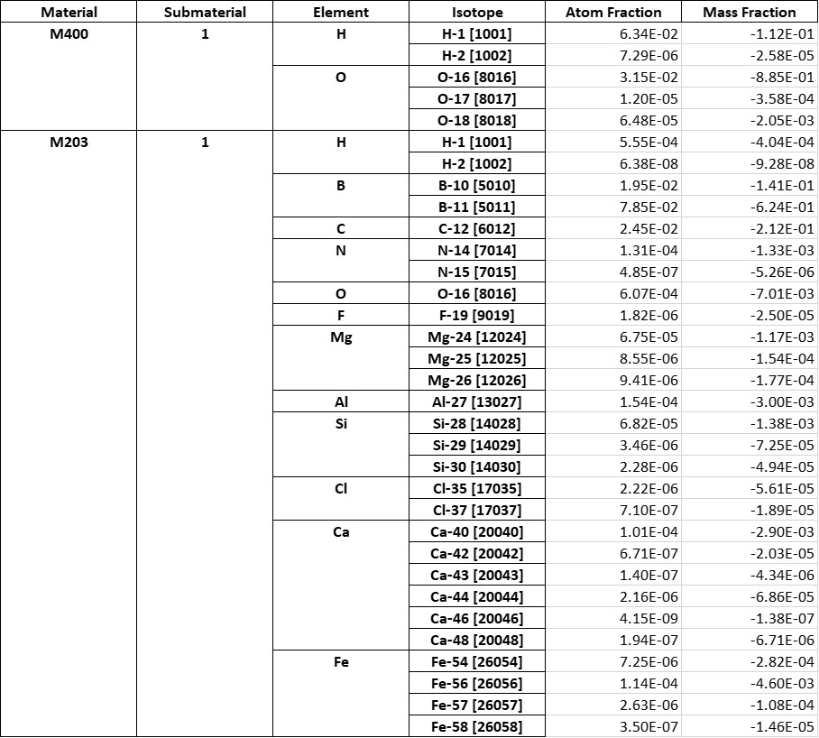
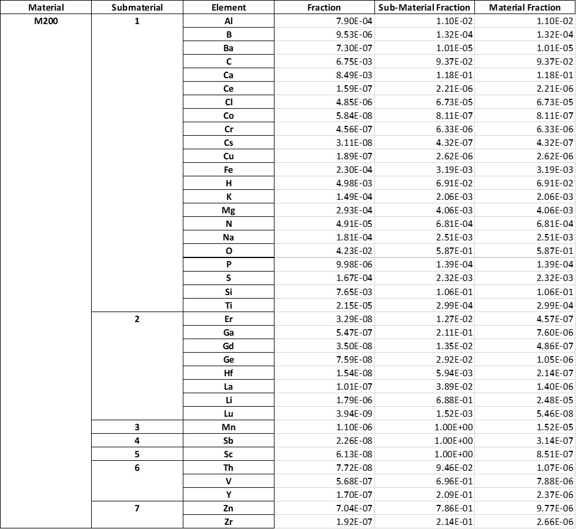
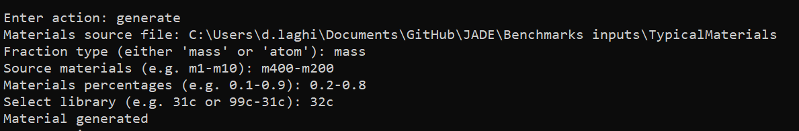

.. _uty:

#########
Utilities
#########
During the development of JADE, many useful classes and methods were developed
which could be used for small stand-alone tools, mostly
operating on MCNP inputs.

A description of these *utilities*, accessible from the JADE main menu,
is here provided.

The outputs (if generated) of these utilities can be found in specific subfolders
of the ``<JADE root>\Utilities`` directory.

Print available libraries
=========================

``printlib``

This function allows to print to video all libraries (suffixes) that are
available in xsdir file indicated in the main configuration file.

    Screenshot of the execution of the ``printlib`` command

Restore default configurations
==============================
``restore``

This function allows to restore the JADE configuration default settings.
In other words, the content of the ``<JADE root>\Configuration`` directory
is restored to "factory installation" and all user modifications to the 
configuration files are lost.

.. note::
    When the the restoration is completed, the application will be terminated.
    The main configuration file ambient variable will need to be reconfigured
    before running another JADE instance.

.. seealso::
    :ref:`mainconfig`

Translate an MCNP input
=======================
``trans``

This function allows to translate a material section of an MCNP input to
a whatever nuclear data library available in the xsdir file.

The translation is carried out basically by the **convertZaid()** method of the
**LibManager** class and by the **translate()** method of the **SubMaterial** class.
The **convertZaid** method:

#. asks for a zaid (to translate) and for a library (to translate to);
#. checks if the library selected for the translation is available in the xsdir of
   the user;
#. select the type of translation:
    a. zaid not available in library: the default lib is used, no other changes
       applied;
    b. zaid available in library: the zaid is converted to the selected library,
       no other changes applied;
    c. the zaid is natural (i.e. it ends with 000).

For case c, at first, the selected library is checked for exact correspondence,
i.e., it is checked if also in the selected library the zaid is expressed as natural.
In this case, the behavior is identical to case b. If this is not true, the zaid needs
to be expanded: all zaids of the same elements are returned with their atomic mass (m)
and natural abundance (NA). All isotopes data is extracted from the
`Commission on Isotopic Abundances and Atomic Weights (CIAAW) <https://ciaaw.org/isotopic-abundances.html>`_
and the data is stored locally in JADE distribution in the
``<JADE root>\Code\Isotopes.txt`` file.

At this point, the **translate()** method completes the translation. No particular actions
are required if there is no zaid expansion.
In case of expansion, if the original natural zaid fraction is an atomic one
(:math:`x^A_N`), the new zaids deriving from the expansion will have as fraction their
natural abundance (NA) multiplied for the original natural zaid fraction:

.. math::
    x^A_{zaid} = \text{NA}_{zaid}\cdot x^A_N

If, instead, the original natural zaid fraction is a mass one (:math:`x^M_N`),
the *equivalent mass* :math:`m_N` of the natural zaid can be computed as:

.. math::
    m_N = \sum_{zaids} \text{NA}_{zaid}\cdot m_{zaid}

and then the mass fraction of each expanded new zaid (:math:`x^M_\text{zaid}`)
can be calculated as:

.. math::
    x^M_\text{zaid}=x^M_N\cdot (\text{NA}_{zaid}\cdot m_{zaid})/M_N
      
where :math:`(\text{NA}_{zaid}\cdot m_{zaid})/M_N`
is basically the natural abundance in mass of the zaid.

The new input will be dumped in the
``<JADE root>\Utilities\Translation`` folder.
The following scheme summarizes the JADE translation logic.

    Zaid translation logic

There are few format that can be used to request a translation:

Default (e.g. ``31c``)
    Only one library is provided and the above described translation 
    procedure is followed

ExactMode (e.g. ``{99c: [1001, 1002], 31c: [8016]}``)
    This mode is used in the automatic translation of D1S inputs where
    the mix between zaids to be used for transport and zaids to be used
    for activation result in additional complexity during the translation.
    The use of such mode is discourauged in the ``trans`` utility. 

1to1Mode (e.g. ``{99c: 98c, 31c: 21c}``)
    In case more than one library have been used in the original input the
    user can provide a dictionary which specifies for each original library
    (e.g. 99c and 31c) to which new library the zaids should be translated to
    (e.g. 31c and 21c).

Print materials info
====================
``printmat``

This function is used to print a summary of an MCNP input material section.
The information is contained in two sheets of an Excel file dumped into the
``<JADE root>\Utilities\Materials Infos`` folder.
The first sheet summarizes information at the single isotope level.
Here both the atom and mass fraction for each zaid is reported divided by
material and submaterial. It may happen that the original fraction appearing
in the MCNP input is not normalized. JADE prints this fraction as it is and
only the alternative fraction is normalized during its calculation.

    Extract of the isotope sheet.

The second sheet summarizes information at the element level.
Three fractions are here listed for each element:

* the fraction of the element in the MCNP material card (often not normalized);
* the normalized fraction of the element in the submaterial;
* the normalized fraction of the element in the material.

Depending on which kind of fraction it was used in the orginal MCNP input,
these three fraction need to be interpreted as either *mass* or *atom* fraction.

    Extract of the element sheet.

Generate material mixture
=========================
``generate``

This function is used to generate a material mixture starting from two or
more materials contained in a single MCNP input. The user will be asked for:

* absolute path to the MCNP input;
* if the zaids need to have a mass or atom fraction;
* material names (e.g. m1) to be used in the mixture;
* percentages to be used in the mixture for each material;
* nuclear data library to use for the new material mixture.

The following is an example of how all these inputs are provided via console.

Each material will be transformed in a submaterial of the newly generated mixture
retaining its header if present. The new material will be dumped in the
``<JADE root>\Utilities\Generated Materials`` folder.

Switch material fractions
=========================
``switch``

This function can be used to switch an MCNP input from having atom fractions
to mass fractions and viceversa. The new input will be dumped in the
``<JADE root>\Utilities\Fraction switch`` folder.

Change .ace libraries suffix
============================
.. versionadded:: v1.3.0
    ``acelib``

This function asks for a directory absolute path and for a new library suffix
(e.g. ``98c``). All .ace files contained in the folder will have their original
suffix changed to the new one. This function operates in a non-destructive way,
that is, the switch is not implemented on the original file but on copies of
them instead. The copies will be saved in a folder created at the same level of
the original one. This function does not modify the XSDIR file. 

Produce D1S-UNED reaction files
===============================
.. versionadded:: v1.3.0
    ``react``

This function, given a D1S input file, produce a correspondent reaction file
where all possible reactions that can originate from the input materials are
listed. The complete list of available reactions for each D1S activation
library is provided (and may be modified) in the ``<JADE_root>\Configuration\Activation.xlsx``
file. 

The generated reaction files are dumped in the ``<JADE root>\Utilities\Reactions`` folder
